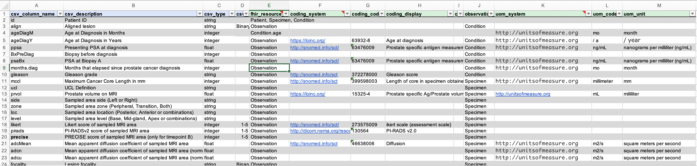
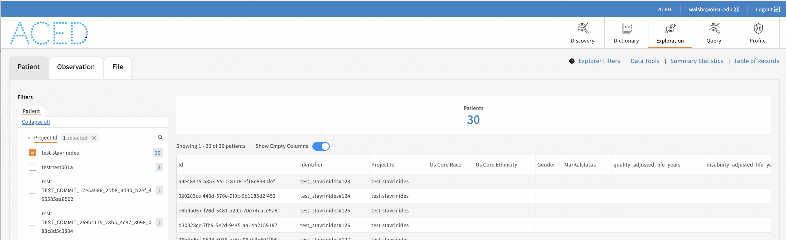
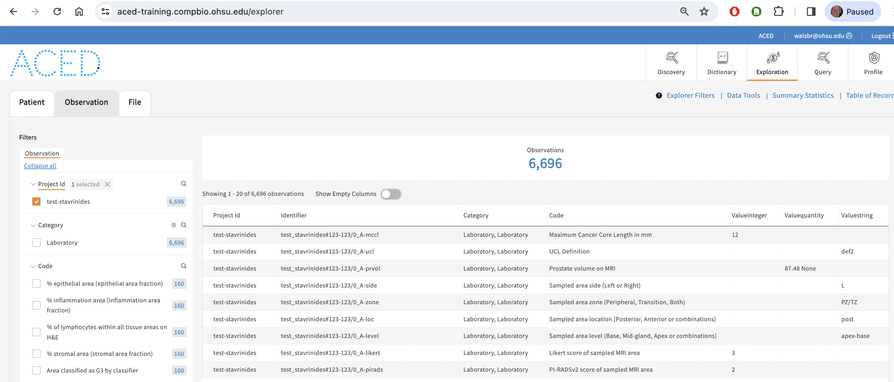
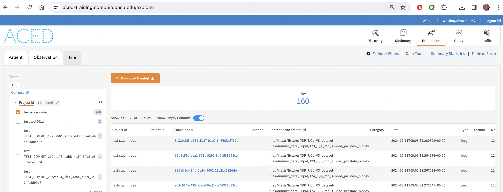

# ucl-stavrinides User Guide

## Overview

`g3t_etl` is a command-line tool designed to manage the metadata. The tool provides various commands, each serving a specific purpose. Below, you'll find a brief guide on how to use the available commands.

## Getting Started


**Clone the Repository:** Clone the forked repository to your local machine using the following command:

```bash
git clone https://github.com/ACED-IDP/ucl-stavrinides
python3 -m venv venv ; source venv/bin/activate
pip install -r requirements.txt
pip install -r requirements-dev.txt
pip install -e .
```
**Install Dependencies**: Ensure you have the necessary dependencies installed.
The installation process will install gen3 tracker utility, see [how to configure it](https://aced-idp.github.io/getting-started/).

**Verify installation**: Run the following command to verify the installation:

```bash
g3t ping
msg: 'Configuration OK: Connected using profile:xxxx'
endpoint: https://aced-idp.org
username: your-email@institution.edu
```

### Global Options

- `--help`: Display information about the available commands and options.

## Commands

### `dictionary`

The `dictionary` is a design stage utility that reads the master data dictionary and creates a corresponding python class.



#### Usage:

```bash
$ g3t_etl dictionary --help
Usage: g3t_etl dictionary [OPTIONS] [INPUT_PATH] [OUTPUT_PATH]

  Code generation. Create python model class from a dictionary spreadsheet.

  Use this command to track changes to the data dictionary.
  INPUT_PATH: where to read master spreadsheet default: docs/IDP_UCL_VS_data_dictionary-IDP_Mapping.xlsx
  OUTPUT_PATH: where to write per subject csvs default: templates/submission.schema.json


```

#### Example:

```bash
Transformed docs/IDP_UCL_VS_data_dictionary-IDP_Mapping.xlsx into jsonschema file in templates/submission.schema.json
Use this command to generate pydantic model from schema:
datamodel-codegen  --input templates/submission.schema.json --input-file-type jsonschema  --output ucl_stavrinides/submission.py --field-extra-keys json_schema_extra
```


### `transform`

The `transform` reads lines from the csv and creates resources representing data for a specific subject and time point.

#### Usage:

```bash
g3t_etl transform --help
Usage: g3t_etl transform [OPTIONS] INPUT_PATH [OUTPUT_PATH]

  Transform csv based on data dictionary to FHIR.

  INPUT_PATH: where to read spreadsheet. required, (convention data/raw/XXXX.xlsx)
  OUTPUT_PATH: where to write FHIR. default: META/


```

#### Configuration:

The transformations are based on the data dictionary and the following resources:

```shell
templates/
├── Condition.yaml
├── Observation.yaml
├── ResearchStudy.yaml
└── submission.schema.json

Where Condition.yaml, Observation.yaml, ResearchStudy.yaml are templates for the respective resources.
and submission.schema.json is the master data dictionary.
```


#### Example:

##### Transforming a csv file to FHIR

```bash
$ g3t_etl transform tests/fixtures/IDP_UCL_VS_dataset/dummy_data_30pid.csv
Transformed tests/fixtures/IDP_UCL_VS_dataset/dummy_data_30pid.csv into META

$ g3t utilities meta validate
templates:
  summary:
    Procedure: 160
    Specimen: 160
    Observation: 6696
    ResearchStudy: 1
    Condition: 30
    ResearchSubject: 30
    Patient: 30
msg: OK

```

##### Uploading the FHIR resources to the server

```bash
$ g3t commit -m "Initial upload"
$ g3t push

```

##### Adding dummy image files

See [dummy file generation](tests/fixtures/IDP_UCL_VS_dataset-files/README.md).

###### association a file with a specimen
```shell
# find all specimen identifiers, and add the file to the index in parallel
$ cat META/Specimen.ndjson | jq -r '.identifier[0].value' | xargs -P 8 -L 1 -I SPECIMEN g3t add --specimen SPECIMEN tests/fixtures/IDP_UCL_VS_dataset-files/dummy_data_30pid/SPECIMEN_mri_guided_prostate_biopsy.jpeg
# create metadata for the files
$ g3t utilities meta create
```

###### commit and push the files
```shell
$ g3t commit -m "Add image files"
$ g3t push
```

###### confirm the files are uploaded
```shell
$ g3t status

remote:
  resource_counts:
    Condition: 30
    DocumentReference: 160
    FamilyMemberHistory: 0
    Medication: 0
    MedicationAdministration: 0
    Observation: 6696
    Patient: 30
    ResearchStudy: 1
    ResearchSubject: 30
    Specimen: 160
    Substance: 0
    Task: 0

```


Loading the tests/fixtures/IDP_UCL_VS_dataset/dummy_data_30pid.csv metadata into a test instance produces the following:





Feel free to explore additional functionalities and options by referring to the [aced documentation](https://aced-idp.github.io/)
